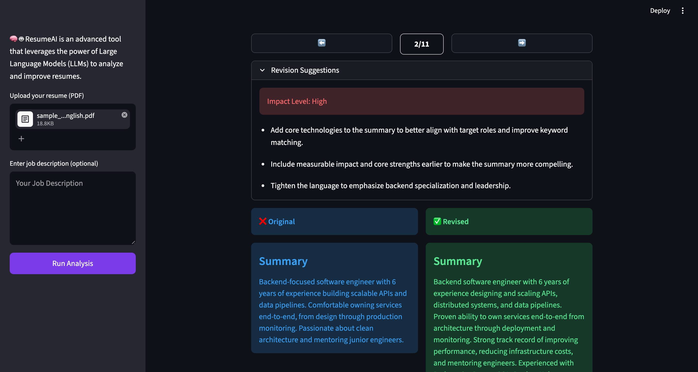

# 📄 ResumeAI — Resume Parser and Reviewer

ResumeAI is a Streamlit app that uses Large Language Models (LLMs) to parse a resume, review it section by section, and suggest improvements — optionally tailored to a specific job description.

## ✨ Features

- 📤 Upload a resume as a PDF
- 🧠 Automatic parsing into structured sections (experience, education, skills, etc.)
- ✅ Side-by-side comparison of **Original** vs **Revised** content per section
- 🎯 Optional job description input for targeted, role-specific feedback
- 📊 Impact level indicator (Low / Medium / High) for each suggested revision

## 🗂️ Project Structure

```
├─ README.md
├─ requirements.txt
└── src/
|    ├── app.py    # Streamlit UI
|    ├── prompts.py   # LLM prompt
|   ├── resume_formatter.py
└── utils/
    ├── llm.py
    ├── pdf_reader.py
    └── yaml.py
```

## 🛠️ Requirements

- Python 3.9+
- An OpenAI API key

### Dependencies

```
streamlit
openai
PyPDF2
pyyaml
```

Install them with:

```bash
pip install -r requirements.txt
```

## 🔑 Setup

1. Clone the repository and navigate into the project folder.
2. Set your OpenAI API key as an environment variable:

   ```bash
   export OPENAI_API_KEY="your-api-key-here"
   ```

   (On Windows: `setx OPENAI_API_KEY "your-api-key-here"`)

3. Run the app:

   ```bash
   cd src
   streamlit run app.py
   ```

4. Open your browser at [http://localhost:8501](http://localhost:8501).

## 🚀 Usage

1. Upload your resume in **PDF** format from the sidebar.
2. (Optional) Paste a job description to get tailored suggestions.
3. Click **Run Analysis**.
4. Browse through each resume section using the ⬅️ / ➡️ buttons to see:
   - The original content
   - The revised/suggested content
   - Impact level and specific revision suggestions

## ⚠️ Notes

- Make sure `OPENAI_API_KEY` is correctly set — the app will fail to authenticate otherwise.
- Large or scanned (image-based) PDFs may not extract text correctly, since text extraction relies on `PyPDF2` and does not perform OCR.
- LLM responses are expected in YAML format; malformed responses from the model may cause parsing errors.

## 🧑🏻‍💻 Creator

Developed with ❤️ by **Amin**
- **Telegram channel:** [@theComputerphile](https://t.me/theComputerphile)

- **GitHub:** [aminbaghaeidev](https://github.com/aminbaghaeidev)
